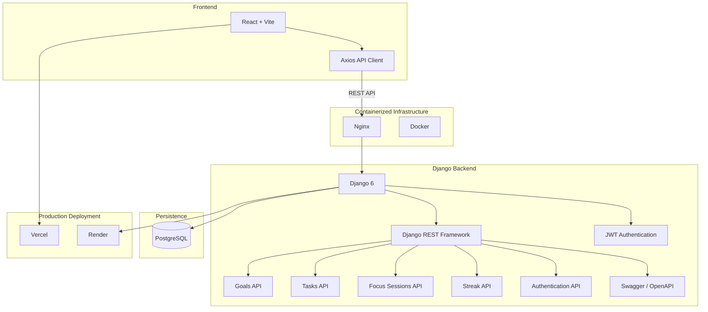

# FocusFlow

---

## 🌟 Overview

**FocusFlow** is a productivity and focus-management application designed to help users organize their goals, manage actionable tasks, track focused work sessions, and maintain productivity streaks.

The system is built around a simple principle:

> **Turn meaningful goals into structured daily execution.**

FocusFlow currently provides a RESTful backend API built with Django and Django REST Framework, a React-based frontend, JWT authentication, PostgreSQL persistence, and a production-style deployment architecture using Docker, Nginx, Render, and Vercel.

The current implementation focuses on establishing a reliable foundation for the platform before introducing the AI productivity layer.

---

## 🌟 Key Features

### 🎯 Goal Management

Users can create and manage goals that represent the larger outcomes they want to accomplish.

Implemented capabilities include:

* Create goals
* Retrieve goals
* Update goals
* Delete goals
* Associate goals with authenticated users
* Track goal completion
* Define goal dates and target dates

Goals provide the foundation from which actionable tasks are created.

---

### ✅ Task Management

Tasks represent the concrete actions required to achieve a goal.

Implemented capabilities include:

* Create tasks
* Retrieve tasks
* Update tasks
* Delete tasks
* Associate tasks with goals
* Associate tasks with authenticated users through their goals
* Task priority management

FocusFlow enforces the relationship between goals and tasks, ensuring that tasks belong to an existing goal.

---

### ⏱️ Focus Session Tracking

FocusFlow allows users to record focused work sessions against their tasks.

Implemented capabilities include:

* Create focus sessions
* Retrieve focus sessions
* Associate sessions with authenticated users
* Associate sessions with specific tasks
* Track session start time
* Track session end time
* Track session duration
* Track completion status

The system also enforces the application's business rule that a user should not have multiple active focus sessions simultaneously.

---

### 🔥 Productivity Streaks

FocusFlow includes a streak system designed to encourage consistent execution.

The current implementation tracks a user's productivity streak based on completion of their goals.

Implemented capabilities include:

* Retrieve a user's streak
* Associate streak information with the authenticated user
* Evaluate productivity completion
* Update streak state based on goal completion

The streak system is designed to evaluate completion at the appropriate point in the user's daily workflow rather than simply incrementing immediately after an individual action.

---

### 🔐 Authentication & Authorization

FocusFlow uses JWT-based authentication to secure its API.

Implemented authentication capabilities include:

* User registration
* JWT login
* Access tokens
* Refresh tokens
* Token verification
* Token refresh
* Authenticated API requests
* Protected endpoints
* User-specific data access
* Logout through refresh-token blacklisting
* Password change
* Profile access

The frontend stores the authentication tokens locally and automatically attaches the access token to authenticated API requests.

The frontend API client also implements automatic access-token refresh when an authenticated request returns a `401 Unauthorized` response.

---

### 🌐 REST API

The backend exposes RESTful endpoints for the core productivity functionality.

Current API resources include:

```text
/api/goals/
/api/tasks/
/api/focus-sessions/
/api/streaks/
```

Authentication endpoints include:

```text
/api/auth/register/
/api/auth/change-password/
/api/auth/logout/
/api/profile/

/api/token/
/api/token/refresh/
/api/token/verify/
```

---

### 📚 API Documentation

The backend uses **drf-spectacular** to generate an OpenAPI schema and interactive API documentation.

Available endpoints include:

```text
/api/schema/
/api/docs/
```

The Swagger interface provides an interactive way to inspect and test the backend API.

---

## 🏗️ Architecture Overview

The current FocusFlow architecture separates the frontend, backend API, database, and reverse-proxy responsibilities.



### Request Flow

A typical authenticated request follows this flow:

```text
React Frontend
      │
      ▼
Axios API Client
      │
      │ JWT Access Token
      ▼
Nginx
      │
      ▼
Django / DRF
      │
      ▼
Authentication
      │
      ▼
Business Logic
      │
      ▼
PostgreSQL
```

This architecture provides a foundation where the frontend and backend can be independently deployed and scaled.

---

## 🛠️ Technology Stack

| Layer                   | Technologies                            |
| ----------------------- | --------------------------------------- |
| **Frontend**            | React, Vite, Axios                      |
| **Backend**             | Python, Django 6, Django REST Framework |
| **Authentication**      | JWT, SimpleJWT                          |
| **Database**            | PostgreSQL 17                           |
| **API Documentation**   | drf-spectacular, OpenAPI, Swagger UI    |
| **Static Files**        | WhiteNoise                              |
| **Reverse Proxy**       | Nginx                                   |
| **Containerization**    | Docker, Docker Compose                  |
| **Frontend Deployment** | Vercel                                  |
| **Backend Deployment**  | Render                                  |
| **Version Control**     | Git, GitHub                             |

---

## 🔐 Security & Production Configuration

FocusFlow has been configured with production-oriented security settings rather than relying solely on Django's default development configuration.

Current security-related configuration includes:

* JWT authentication
* Protected API endpoints
* Refresh-token handling
* Refresh-token blacklisting on logout
* Secure session cookies
* Secure CSRF cookies
* HTTPS-aware Django configuration
* `SECURE_SSL_REDIRECT`
* `SECURE_PROXY_SSL_HEADER`
* HTTP-only session cookies
* SameSite cookie configuration
* HSTS configuration
* `X-Frame-Options`
* `X-Content-Type-Options`
* Configurable `ALLOWED_HOSTS`
* CORS configuration
* Environment-based secrets and configuration

The application is designed to operate behind a reverse proxy in production.

---

## 🐳 Docker Architecture

FocusFlow uses Docker Compose to reproduce a production-style backend environment locally.

The current container architecture consists of:

```text
┌───────────────────────────┐
│          Nginx            │
│        Port 80            │
│       Reverse Proxy       │
└─────────────┬─────────────┘
              │
              ▼
┌───────────────────────────┐
│       Django / DRF        │
│        Port 8000           │
│        Backend API         │
└─────────────┬─────────────┘
              │
              ▼
┌───────────────────────────┐
│        PostgreSQL         │
│          Port 5432         │
└───────────────────────────┘
```

Docker Compose manages the services and their networking.

The backend container is not directly exposed to the host. Nginx acts as the public entry point and forwards requests to the Django application.

This allows local development to more closely resemble the eventual production architecture.

---

## ☁️ Deployment

### Frontend

The FocusFlow frontend is deployed using **Vercel**.

Current deployment configuration:

```text
Framework: Vite
Root Directory: Frontend/focusflow-frontend
Install Command: npm install
Build Command: npm run build
Output Directory: dist
Development Command: npm run dev
```

The production frontend communicates with the deployed Django API.

---

### Backend

The Django backend is deployed using **Render**.

Production backend:

```text
https://focusflow-3n3u.onrender.com
```

The backend runs with PostgreSQL as its production database and is configured for HTTPS-aware operation behind the deployment infrastructure.

---

## 🔄 Frontend ↔ Backend Integration

The React frontend communicates with the Django backend through an Axios-based API client.

The API client provides:

* Centralized API configuration
* Request timeouts
* JWT authorization headers
* Access-token retrieval
* Refresh-token retrieval
* Automatic token refresh
* Authentication error handling
* API error normalization
* Automatic logout when token refresh fails

The production API URL is configured through a Vite environment variable:

```env
VITE_API_BASE_URL=https://focusflow-3n3u.onrender.com
```

This keeps the frontend independent of the backend deployment environment.

---

## 🧪 Testing

The backend has been tested through API and integration testing during development and deployment.

Testing has covered the core application workflows, including:

### Authentication

* User registration
* User login
* JWT access-token generation
* Protected endpoint access
* Token refresh
* Logout

### Goals

* Retrieve goals
* Create goals
* Update goals
* Delete goals

### Tasks

* Retrieve tasks
* Create tasks
* Update tasks
* Delete tasks

### Focus Sessions

* Retrieve focus sessions
* Create focus sessions
* Validate task relationships
* Validate authenticated-user ownership

### Streaks

* Retrieve streak information
* Validate streak ownership
* Validate streak business logic

### Frontend ↔ Backend

The deployed frontend has also been tested against the deployed backend to verify that the production API integration works correctly.

---

## 📖 API Endpoints

### Authentication

| Method | Endpoint                     | Description                           |
| ------ | ---------------------------- | ------------------------------------- |
| `POST` | `/api/auth/register/`        | Register a new user                   |
| `POST` | `/api/token/`                | Authenticate and obtain JWT tokens    |
| `POST` | `/api/token/refresh/`        | Refresh an access token               |
| `POST` | `/api/token/verify/`         | Verify a JWT token                    |
| `GET`  | `/api/profile/`              | Retrieve authenticated user's profile |
| `POST` | `/api/auth/change-password/` | Change user password                  |
| `POST` | `/api/auth/logout/`          | Logout and blacklist refresh token    |

### Goals

| Method   | Endpoint           | Description    |
| -------- | ------------------ | -------------- |
| `GET`    | `/api/goals/`      | Retrieve goals |
| `POST`   | `/api/goals/`      | Create a goal  |
| `PUT`    | `/api/goals/<id>/` | Update a goal  |
| `DELETE` | `/api/goals/<id>/` | Delete a goal  |

### Tasks

| Method   | Endpoint           | Description    |
| -------- | ------------------ | -------------- |
| `GET`    | `/api/tasks/`      | Retrieve tasks |
| `POST`   | `/api/tasks/`      | Create a task  |
| `PUT`    | `/api/tasks/<id>/` | Update a task  |
| `DELETE` | `/api/tasks/<id>/` | Delete a task  |

### Focus Sessions

| Method   | Endpoint                    | Description             |
| -------- | --------------------------- | ----------------------- |
| `GET`    | `/api/focus-sessions/`      | Retrieve focus sessions |
| `POST`   | `/api/focus-sessions/`      | Create a focus session  |
| `PUT`    | `/api/focus-sessions/<id>/` | Update a focus session  |
| `DELETE` | `/api/focus-sessions/<id>/` | Delete a focus session  |

### Streaks

| Method | Endpoint        | Description                              |
| ------ | --------------- | ---------------------------------------- |
| `GET`  | `/api/streaks/` | Retrieve the authenticated user's streak |

---

## 📁 Project Structure

```text
FocusFlow/
│
├── Backend/
│   │
│   ├── Backend/
│   │   ├── settings.py       # Django configuration
│   │   ├── urls.py           # Root URL configuration
│   │   ├── views.py          # Root views
│   │   ├── wsgi.py           # WSGI configuration
│   │   └── ...
│   │
│   ├── accounts/
│   │   ├── urls.py            # Authentication routes
│   │   ├── views.py           # Authentication/profile logic
│   │   ├── serializers.py     # Authentication serializers
│   │   └── ...
│   │
│   ├── productivity/
│   │   ├── urls.py            # Productivity API routes
│   │   ├── views.py           # Goals/tasks/sessions/streak logic
│   │   ├── serializers.py     # API serializers
│   │   ├── models.py          # Productivity data models
│   │   └── ...
│   │
│   ├── nginx/
│   │   └── default.conf       # Nginx reverse-proxy configuration
│   │
│   ├── Dockerfile
│   ├── docker-compose.yml
│   ├── entrypoint.sh
│   ├── requirements.txt
│   └── manage.py
│
├── Frontend/
│   │
│   └── focusflow-frontend/
│       ├── src/
│       │   ├── components/     # Reusable React components
│       │   ├── pages/          # Application pages
│       │   ├── services/       # API clients and services
│       │   ├── lib/            # Shared frontend utilities
│       │   └── ...
│       │
│       ├── public/
│       ├── package.json
│       ├── vite.config.js
│       └── ...
│
└── README.md
```

---

## 🚧 Current Status

FocusFlow currently has the following foundation implemented:

* [x] React frontend
* [x] Django backend
* [x] PostgreSQL database
* [x] User registration
* [x] JWT authentication
* [x] Token refresh
* [x] Token blacklisting on logout
* [x] Protected API endpoints
* [x] Goal management
* [x] Task management
* [x] Focus session tracking
* [x] Productivity streaks
* [x] API documentation
* [x] Dockerized backend environment
* [x] Nginx reverse proxy
* [x] Production-oriented security configuration
* [x] Backend deployment on Render
* [x] Frontend deployment on Vercel
* [x] Frontend ↔ backend production integration
* [x] Core API testing

### AI Layer

The AI productivity layer is **not yet implemented**.

It is planned as the next major development stage of FocusFlow and will build on top of the existing goals, tasks, focus-session, and streak data.

The current architecture intentionally establishes the core application and deployment foundation before introducing AI capabilities.

---

## 🗺️ Roadmap

Future development will focus on turning FocusFlow from a traditional productivity application into an intelligent productivity platform.

Planned areas include:

* AI-powered daily planning
* Intelligent task prioritization
* AI task decomposition
* Productivity insights
* Focus-session analysis
* Personalized productivity recommendations
* AI-powered weekly reviews
* Intelligent goal planning

These capabilities will be introduced on top of the existing API and data architecture rather than replacing the current productivity system.

---

## 🚀 Getting Started

### Prerequisites

Make sure you have the following installed:

* Python 3.12+
* Node.js 20+
* npm
* Docker
* Docker Compose
* Git
* PostgreSQL-compatible environment

### Clone the Repository

```bash
git clone https://github.com/tendocalvin1/FocusFlow.git
cd FocusFlow
```

---

### Backend Setup

```bash
cd Backend
```

Create a virtual environment:

```bash
python -m venv venv
```

Activate it on Windows:

```powershell
.\venv\Scripts\Activate.ps1
```

Install dependencies:

```bash
pip install -r requirements.txt
```

Create your environment file:

```bash
.env
```

Configure the required Django and database environment variables.

Run migrations:

```bash
python manage.py migrate
```

Start the development server:

```bash
python manage.py runserver
```

---

### Frontend Setup

```bash
cd Frontend/focusflow-frontend
```

Install dependencies:

```bash
npm install
```

Configure the backend URL:

```env
VITE_API_BASE_URL=http://localhost:8000
```

Start the development server:

```bash
npm run dev
```

---

### Docker Development

From the backend directory:

```bash
docker compose up -d
```

Check running services:

```bash
docker compose ps
```

Stop services:

```bash
docker compose down
```

---

## 📄 License

This project is currently available for development and portfolio purposes.

---

## 👤 Author

**Tendo Calvin**

Backend-focused Full-Stack Software Engineer

* GitHub: [@tendocalvin1](https://github.com/tendocalvin1)
* LinkedIn: Tendo Calvin
* Based in Uganda 🇺🇬

---

## ⭐ Project Philosophy

FocusFlow is being built as more than a demonstration CRUD application.

The project is being developed incrementally around real software engineering concerns:

```text
Product Requirements
        ↓
Database Design
        ↓
REST API
        ↓
Authentication
        ↓
Business Logic
        ↓
Testing
        ↓
Docker
        ↓
Nginx
        ↓
Production Deployment
        ↓
Frontend Integration
        ↓
AI Layer
```

The current milestone is the completion of the **core productivity platform and its production deployment foundation**.

The next milestone is to introduce intelligence into the system without compromising the reliability of the underlying application.
